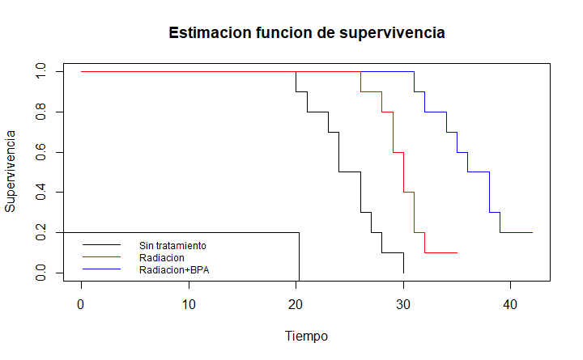

# Survival Analysis

El análisis de supervivencia es una técnica estadística que se utiliza para evaluar la duración de un evento en el tiempo. En el contexto empresarial, se emplea para comprender la probabilidad de que una empresa siga funcionando durante un período determinado.

Algunas razones por las que esta herramienta resulta de gran importancia para las empresas son:
-Mejorar las estrategias de retención de clientes: El análisis de supervivencia puede usarse para identificar a los clientes con mayor riesgo de abandonar la empresa, permitiendo implementar estrategias personalizadas para retenerlos.
-Optimizar la gestión de inventario: Se puede utilizar para determinar la vida útil óptima de los productos, reduciendo así los costos de almacenamiento y obsolescencia.
-Medir el impacto de las iniciativas estratégicas: Se puede utilizar para evaluar el efecto de cambios en la estrategia empresarial, productos o servicios en la tasa de supervivencia.

Las empresas están utilizando cada vez más el análisis de supervivencia para obtener información competitiva y tomar decisiones estratégicas. Algunas de las prácticas actuales incluyen:
-Utilizar modelos de supervivencia paramétricos y no paramétricos: Estos modelos permiten a las empresas estimar la probabilidad de que un evento ocurra en un momento determinado.
-Análisis de datos de cohortes: Este enfoque implica analizar grupos de empresas o clientes que comparten características similares.

# Eficacia de tratamiento en terapia

Se realizó un estudio para determinar la ecacia de la terapia de captura de
neutrones de boro (BNCT) en el tratamiento del glioma F98 refractario a la terapia, utilizando borofenilalanina (BPA) como agente de captura. Se implantaron células de glioma F98 en cerebros de ratas. Se estudiaron tres grupos de ratas. Un grupo no recibió tratamiento, otro fue tratado solo con radiación y el tercer grupo recibió radiación más una concentración adecuada de BPA. Los datos para los tres grupos enumeran los tiempos de muerte (en días) y se dan a continuación:

| sin tratamiento | Radiación | Radiación+BPA |
|-----------------|-----------|---------------|
|20               | 26        | 31            |
|21               | 28        | 32            |
|23               | 29        | 34            |
|24               | 29        | 35            |
|24               | 30        | 36            |
|26               | 30        | 38            |
|26               | 31        | 38            |
|27               | 31        | 39            |
|28               | 32        | 42+           |
|30               | 35+       | 42+           |

## Análisis

Usando los datos dados, comparemos las curvas de supervivencia para los tres grupos.

Parece ser que entre más tratamiento se les da a las ratas más tiempo sobreviven. Esto es que hay una diferencia dentre sus funciones de supervivencia y además parece tener una tendencia. 

### Pruebas de hipótesis

Hagamos pruebas por parejas para determinar si hay alguna diferencia en la supervivencia entre parejas de grupos.

Usando los pesos log rango obtenemos los estadísticos donde probamos si son diferentes los reisgos entre los grupos(por pares). Para el grupo **sin tratamiento** y con solo **radiación** obtenemos 
| Z    |
|------|
|3.3781| 
lo que implica que debemos rechazar la hipótesis de que las funciones de riesgo entre estos dos grupos son iguales.

 Para el grupo **sin tratamiento** y con **radiación+BPA**
| Z    |
|------|
|4.6551|
por lo tanto debemos rechazar la hipótesis de que las funciones de riesgo entre estos dos grupos son iguales.

Finalmente para los grupos con solo **radiación** y con **radiación+BPA**
| Z    |
|------|
|3.1856|
lo que implica que debemos rechazar la hipótesis de que las funciones de riesgo entre estos
dos grupos son iguales.

Existe evidencia a priori de que, si hay una diferencia en la supervivencia, debería haber un orden natural, es decir, los animales no tratados tendrán la peor supervivencia, las ratas irradiadas tendrán una supervivencia ligeramente mejorada y las ratas irradiadas con BPA deberían tener la mejor supervivencia. supervivencia.

Hagamos una prueba de tendencia para verificar la hipótesis de orden.

Para la prueba de la tendencia el estadístico de prueba resulta 
| Z     |
|-------|
|-2.4978|
lo que implica que se debe de rechazar la hipótesis nula a favor de la alternativa, es decir, hay una tendencia en las funciones de riesgo de los grupos.

